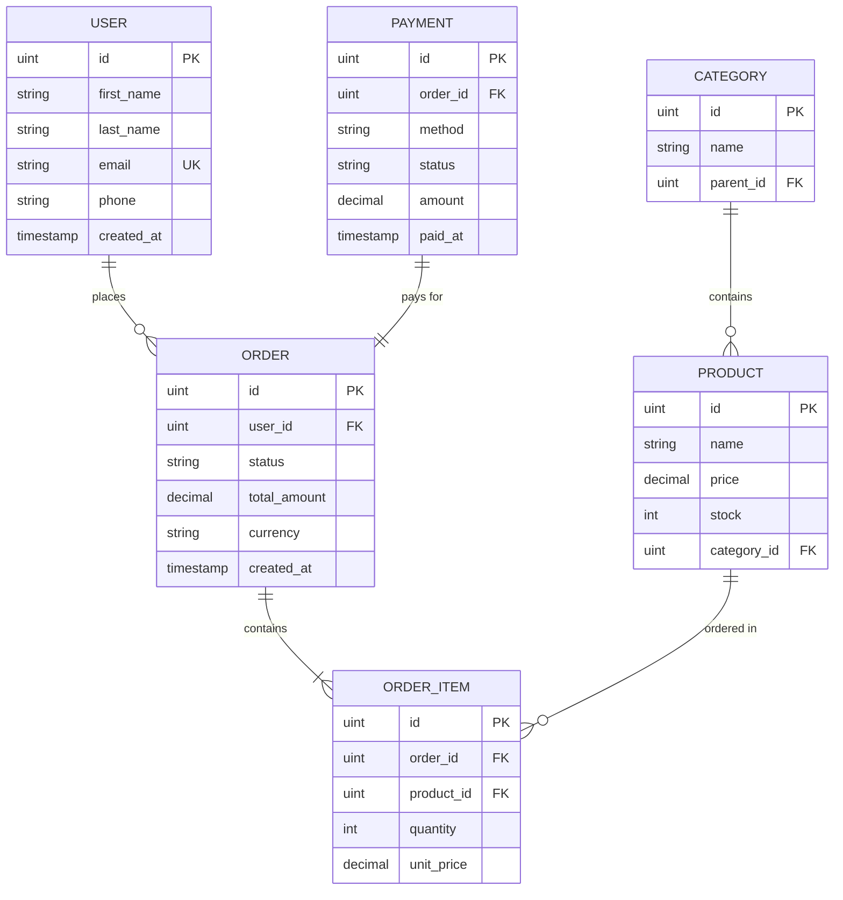
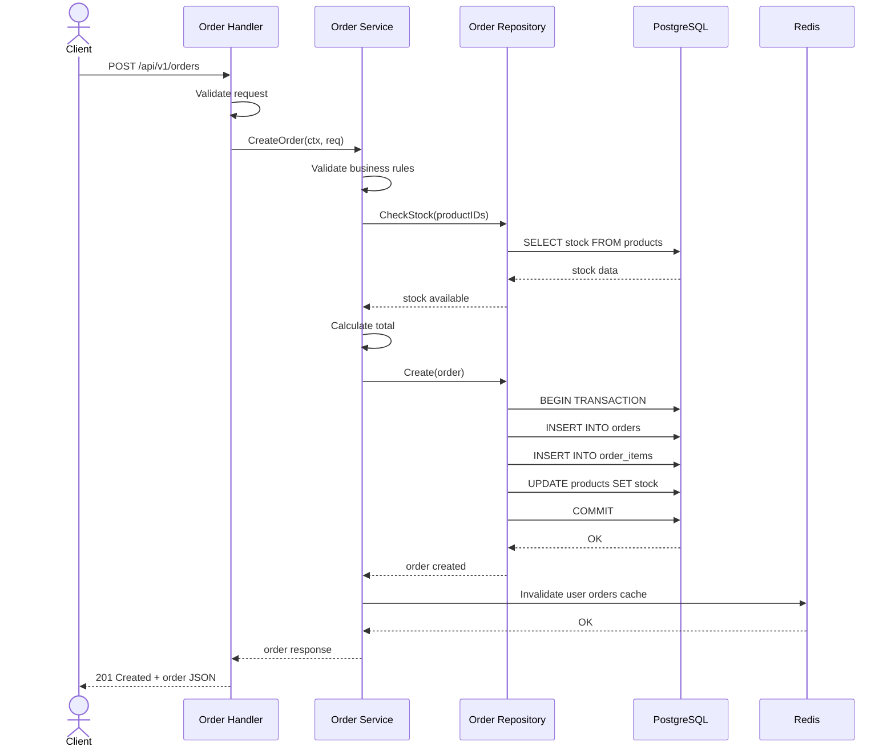
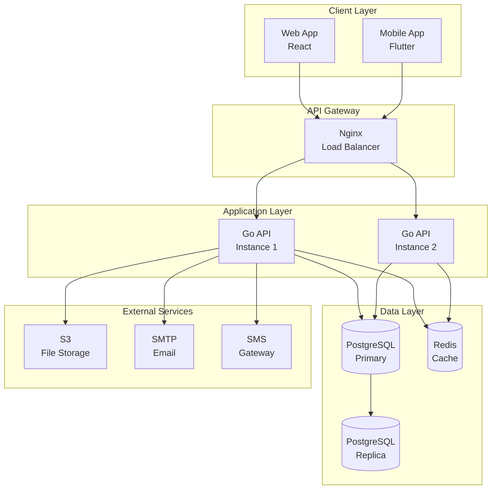

# สถาปัตยกรรมและการออกแบบ

## Architecture & Design with Claude Code

> **บทที่ 6** — คู่มือภายในสำหรับทีมพัฒนา
> ครอบคลุมการใช้ Claude Code เพื่อวิเคราะห์ ออกแบบ และปรับปรุงสถาปัตยกรรมซอฟต์แวร์
> ตั้งแต่การวิเคราะห์ระบบที่มีอยู่ ไปจนถึงการออกแบบ API, Database, และ Design Patterns

---

## สารบัญ

- [6.1 Claude Code เป็น Architecture Assistant](#61-claude-code-เป็น-architecture-assistant)
- [6.2 วิเคราะห์สถาปัตยกรรมที่มีอยู่](#62-วิเคราะห์สถาปัตยกรรมที่มีอยู่)
- [6.3 Design Patterns สำหรับ Go](#63-design-patterns-สำหรับ-go)
- [6.4 Database Design](#64-database-design)
- [6.5 API Design](#65-api-design)
- [6.6 Architecture Decision Records (ADR)](#66-architecture-decision-records-adr)
- [6.7 Refactoring Workflow](#67-refactoring-workflow)
- [6.8 Diagram Generation](#68-diagram-generation)
- [Cross-References](#cross-references)

---

## 6.1 Claude Code เป็น Architecture Assistant

### มากกว่าเครื่องมือสร้างโค้ด

Claude Code ไม่ได้เป็นเพียงเครื่องมือเขียนโค้ดอัตโนมัติ แต่สามารถทำหน้าที่เป็น **ผู้ช่วยด้านสถาปัตยกรรม**
(Architecture Assistant) ที่เข้าใจ patterns, dependencies และ trade-offs ของระบบ

| ความสามารถ | รายละเอียด |
|-----------|-----------|
| Architecture Review | วิเคราะห์โครงสร้างระบบที่มีอยู่ ชี้จุดอ่อนและจุดแข็ง |
| Design Patterns | แนะนำ patterns ที่เหมาะกับปัญหาเฉพาะ |
| Dependency Analysis | ตรวจสอบ dependencies ระหว่าง packages |
| Refactoring Planning | วางแผนการปรับปรุงโค้ดแบบเป็นขั้นตอน |
| Documentation | สร้างเอกสาร architecture อัตโนมัติ |
| Diagramming | สร้าง diagrams (Mermaid, PlantUML) จาก codebase |

### Use Cases หลัก

**1. Architecture Review — ตรวจสอบระบบที่มีอยู่**

```
วิเคราะห์สถาปัตยกรรมของ project นี้:
1. โครงสร้าง directory เป็นอย่างไร
2. มี layering ที่ชัดเจนหรือไม่
3. แต่ละ layer มี responsibility อะไร
4. มีส่วนไหนที่ควรปรับปรุง
```

**2. Design Consultation — ปรึกษาก่อนเริ่มสร้าง**

```
ฉันต้องการสร้างระบบ notification ที่รองรับ:
- Email, SMS, Push notification
- Retry mechanism เมื่อส่งไม่สำเร็จ
- Template-based messages
- Queue-based processing

แนะนำ architecture ที่เหมาะสม พร้อม Go interfaces
```

**3. Refactoring Guidance — แนะนำการปรับปรุง**

```
ไฟล์ internal/handler/order.go ยาว 800 บรรทัด
ช่วยวิเคราะห์แล้วแนะนำวิธี refactor ให้ maintainable
```

> **Tip:** เมื่อถาม Claude Code เรื่องสถาปัตยกรรม ให้ระบุ context ของระบบให้ชัดเจน เช่น
> tech stack, ขนาดทีม, ปริมาณ traffic, และ constraints ที่มี จะช่วยให้คำแนะนำตรงจุดมากขึ้น

---

## 6.2 วิเคราะห์สถาปัตยกรรมที่มีอยู่

### Dependency Analysis

การวิเคราะห์ความสัมพันธ์ระหว่าง packages เป็นจุดเริ่มต้นที่สำคัญในการทำความเข้าใจสถาปัตยกรรม

```
วิเคราะห์ dependencies ของ package internal/service/:
1. แต่ละ service import อะไรบ้าง
2. มี circular dependencies หรือไม่
3. แนะนำวิธีแก้ไข dependency issues
4. แสดงผลเป็น dependency graph
```

ตัวอย่างผลลัพธ์ที่คาดหวัง:

```
internal/service/order.go
  ├── imports: internal/repository (OK - ชั้นล่าง)
  ├── imports: internal/model (OK - shared types)
  ├── imports: internal/service/user (WARNING - same layer)
  └── imports: internal/handler/middleware (VIOLATION - ชั้นบน)

Circular Dependency Detected:
  service/order → service/inventory → service/order

แนะนำ: แยก shared logic เป็น service/common หรือใช้ interface
```

### Pattern Recognition

```
วิเคราะห์ codebase แล้วระบุ:
1. Design patterns ที่ใช้อยู่
2. Patterns ที่ไม่สม่ำเสมอ (inconsistent)
3. Anti-patterns ที่พบ
4. แนะนำ improvements
```

> **Warning:** หาก Claude Code พบ anti-patterns ควรประเมินความเสี่ยงก่อน refactor
> เพราะบาง pattern อาจมีเหตุผลเฉพาะ (historical decisions) ที่ทำให้เลือกใช้

### Architecture Audit — ตรวจสอบเชิงลึก

Prompt สำหรับ audit เต็มรูปแบบ:

```
ทำ Architecture Audit สำหรับ project นี้:

## Layering Analysis
- ระบุว่ามีกี่ layers
- แต่ละ layer มี boundaries ชัดเจนหรือไม่
- มี layer violations (เรียกข้าม layer) หรือไม่

## Separation of Concerns
- แต่ละ package มี single responsibility หรือไม่
- มี god objects/packages หรือไม่
- Business logic แยกจาก infrastructure หรือไม่

## Error Handling
- Error handling consistent หรือไม่
- มี error wrapping ที่เหมาะสมหรือไม่
- Errors ถูก propagate อย่างถูกต้องหรือไม่

## Configuration
- Config management เป็น centralized หรือไม่
- Secrets ถูกจัดการอย่างปลอดภัยหรือไม่

## ผลลัพธ์
- สรุปจุดแข็ง/จุดอ่อน
- จัดลำดับความสำคัญของสิ่งที่ควรปรับปรุง
- แนะนำ action items
```

---

## 6.3 Design Patterns สำหรับ Go

### Factory Pattern

ใช้เมื่อต้องสร้าง objects ที่ซับซ้อน หรือต้องการซ่อน implementation details

```go
// factory.go — ตัวอย่าง Factory Pattern ใน Go

// NotificationType กำหนดประเภทการแจ้งเตือน
type NotificationType string

const (
    NotificationEmail NotificationType = "email"
    NotificationSMS   NotificationType = "sms"
    NotificationPush  NotificationType = "push"
)

// Notifier คือ interface สำหรับการส่งแจ้งเตือน
type Notifier interface {
    Send(to string, message string) error
}

// NewNotifier สร้าง Notifier ตามประเภทที่ระบุ (Factory Function)
func NewNotifier(nType NotificationType, config *Config) (Notifier, error) {
    switch nType {
    case NotificationEmail:
        return NewEmailNotifier(config.SMTP), nil
    case NotificationSMS:
        return NewSMSNotifier(config.Twilio), nil
    case NotificationPush:
        return NewPushNotifier(config.Firebase), nil
    default:
        return nil, fmt.Errorf("unsupported notification type: %s", nType)
    }
}
```

**เมื่อไหร่ควรใช้:**
- มี object หลายชนิดที่ implement interface เดียวกัน
- การสร้าง object ต้องการ configuration ที่ซับซ้อน
- ต้องการ decouple client code จาก concrete implementations

### Strategy Pattern

ใช้เมื่อต้องการเปลี่ยน algorithm (พฤติกรรม) ได้ตอน runtime

```go
// strategy.go — ตัวอย่าง Strategy Pattern สำหรับ Payment Processing

// PaymentStrategy กำหนด interface สำหรับการชำระเงิน
type PaymentStrategy interface {
    Pay(amount decimal.Decimal, currency string) (*PaymentResult, error)
    Refund(transactionID string, amount decimal.Decimal) error
    Name() string
}

// CreditCardPayment ชำระผ่านบัตรเครดิต
type CreditCardPayment struct {
    gateway CreditCardGateway
}

func (c *CreditCardPayment) Pay(amount decimal.Decimal, currency string) (*PaymentResult, error) {
    return c.gateway.Charge(amount, currency)
}

func (c *CreditCardPayment) Refund(txID string, amount decimal.Decimal) error {
    return c.gateway.Refund(txID, amount)
}

func (c *CreditCardPayment) Name() string { return "credit_card" }

// PromptPayPayment ชำระผ่าน PromptPay (QR Code)
type PromptPayPayment struct {
    client PromptPayClient
}

func (p *PromptPayPayment) Pay(amount decimal.Decimal, currency string) (*PaymentResult, error) {
    qr, err := p.client.GenerateQR(amount)
    if err != nil {
        return nil, err
    }
    return &PaymentResult{QRCode: qr, Status: "pending"}, nil
}

// PaymentService ใช้ strategy ในการชำระเงิน
type PaymentService struct {
    strategies map[string]PaymentStrategy
}

func (s *PaymentService) ProcessPayment(method string, amount decimal.Decimal, currency string) (*PaymentResult, error) {
    strategy, ok := s.strategies[method]
    if !ok {
        return nil, fmt.Errorf("unsupported payment method: %s", method)
    }
    return strategy.Pay(amount, currency)
}
```

### Registry Pattern

ใช้สำหรับลงทะเบียนและค้นหา handlers/plugins แบบ dynamic

```go
// registry.go — ตัวอย่าง Registry Pattern

// HandlerFunc คือ function type สำหรับจัดการ events
type HandlerFunc func(ctx context.Context, event Event) error

// EventRegistry เก็บรวบรวม event handlers
type EventRegistry struct {
    mu       sync.RWMutex
    handlers map[string][]HandlerFunc
}

// NewEventRegistry สร้าง registry ใหม่
func NewEventRegistry() *EventRegistry {
    return &EventRegistry{
        handlers: make(map[string][]HandlerFunc),
    }
}

// Register ลงทะเบียน handler สำหรับ event type ที่ระบุ
func (r *EventRegistry) Register(eventType string, handler HandlerFunc) {
    r.mu.Lock()
    defer r.mu.Unlock()
    r.handlers[eventType] = append(r.handlers[eventType], handler)
}

// Dispatch ส่ง event ไปยัง handlers ที่ลงทะเบียนไว้
func (r *EventRegistry) Dispatch(ctx context.Context, event Event) error {
    r.mu.RLock()
    handlers, ok := r.handlers[event.Type]
    r.mu.RUnlock()

    if !ok {
        return fmt.Errorf("no handlers registered for event: %s", event.Type)
    }

    for _, h := range handlers {
        if err := h(ctx, event); err != nil {
            return fmt.Errorf("handler error for %s: %w", event.Type, err)
        }
    }
    return nil
}
```

### Three-Layer Architecture

โครงสร้างสามชั้น (Three-Layer Architecture) เป็นรูปแบบมาตรฐานสำหรับ Go web applications:

```
Handler (HTTP Layer)
    │
    ▼
Service (Business Logic Layer)
    │
    ▼
Repository (Data Access Layer)
```

**แต่ละ layer มีหน้าที่ดังนี้:**

| Layer | หน้าที่ | ตัวอย่าง |
|-------|--------|---------|
| Handler | รับ/ตอบ HTTP requests, validation, auth | รับ JSON → validate → เรียก service → ส่ง response |
| Service | Business logic, orchestration | ตรวจสอบ stock → คำนวณราคา → สร้าง order |
| Repository | CRUD operations, database queries | INSERT, SELECT, UPDATE, DELETE |

**โครงสร้าง directory:**

```
internal/
├── handler/          # HTTP handlers (Fiber)
│   ├── user.go
│   ├── order.go
│   └── middleware/
│       ├── auth.go
│       └── logging.go
├── service/          # Business logic
│   ├── user.go
│   ├── order.go
│   └── notification.go
├── repository/       # Data access
│   ├── user.go
│   ├── order.go
│   └── product.go
├── model/            # Shared data structures
│   ├── user.go
│   ├── order.go
│   └── product.go
└── dto/              # Data Transfer Objects
    ├── request/
    │   └── order.go
    └── response/
        └── order.go
```

**กฎสำคัญ:**

> **Warning:** ละเมิดกฎเหล่านี้จะทำให้สถาปัตยกรรมเสียหาย (Architecture Erosion)

1. **Handler ห้ามเรียก Repository โดยตรง** — ต้องผ่าน Service เสมอ
2. **Service ห้าม import HTTP packages** — ไม่ควรรู้จัก `fiber.Ctx` หรือ HTTP status codes
3. **Repository ห้ามมี business logic** — ทำแค่ CRUD เท่านั้น
4. **แต่ละ layer สื่อสารผ่าน interfaces** — เพื่อให้ test ง่ายด้วย mocks

---

## 6.4 Database Design

### Schema Design ด้วย Claude Code

ให้ Claude Code ช่วยออกแบบ database schema จาก requirements:

```
ออกแบบ database schema สำหรับระบบ e-commerce:

Tables ที่ต้องการ:
- Users: ข้อมูลผู้ใช้, authentication
- Products: สินค้า, categories, pricing
- Orders: คำสั่งซื้อ, order items
- Payments: การชำระเงิน

Requirements:
- Soft delete ทุก table (deleted_at)
- Audit trail (created_by, updated_by)
- Multi-currency support
- Product variants (size, color)

Tech stack: PostgreSQL + GORM
สร้างเป็น Go structs พร้อม GORM tags
```

### GORM Conventions

**Naming Conventions:**

```go
// GORM จะแปลง struct fields เป็น snake_case columns อัตโนมัติ
type User struct {
    ID        uint           `gorm:"primaryKey"`
    FirstName string         `gorm:"type:varchar(100);not null"`
    LastName  string         `gorm:"type:varchar(100);not null"`
    Email     string         `gorm:"type:varchar(255);uniqueIndex;not null"`
    Phone     *string        `gorm:"type:varchar(20)"` // nullable field ใช้ pointer
    Role      string         `gorm:"type:varchar(20);default:'user'"`
    IsActive  bool           `gorm:"default:true"`
    CreatedAt time.Time
    UpdatedAt time.Time
    DeletedAt gorm.DeletedAt `gorm:"index"` // Soft delete
}
// ตาราง: users
// Columns: id, first_name, last_name, email, phone, role, is_active,
//          created_at, updated_at, deleted_at
```

**Relations:**

```go
// HasMany — User มี Orders หลายรายการ
type User struct {
    ID     uint    `gorm:"primaryKey"`
    Orders []Order `gorm:"foreignKey:UserID"`
}

// BelongsTo — Order เป็นของ User คนเดียว
type Order struct {
    ID     uint `gorm:"primaryKey"`
    UserID uint `gorm:"not null;index"`
    User   User `gorm:"foreignKey:UserID"`
}

// ManyToMany — Product มีหลาย Categories, Category มีหลาย Products
type Product struct {
    ID         uint       `gorm:"primaryKey"`
    Categories []Category `gorm:"many2many:product_categories;"`
}
```

**Hooks:**

```go
// BeforeCreate — ทำก่อนบันทึกข้อมูลใหม่
func (u *User) BeforeCreate(tx *gorm.DB) error {
    hashedPassword, err := bcrypt.GenerateFromPassword(
        []byte(u.Password), bcrypt.DefaultCost,
    )
    if err != nil {
        return err
    }
    u.Password = string(hashedPassword)
    u.ID = 0 // ป้องกัน client ส่ง ID มา
    return nil
}

// AfterCreate — ทำหลังบันทึกข้อมูลสำเร็จ
func (u *User) AfterCreate(tx *gorm.DB) error {
    // ส่ง welcome email
    return nil
}
```

### Indexing Strategy

ให้ Claude Code วิเคราะห์ queries ที่ใช้บ่อยแล้วแนะนำ indexes:

```
วิเคราะห์ repository layer ของ project แล้วแนะนำ indexes:

1. ดู queries ที่ใช้บ่อย (WHERE, JOIN, ORDER BY)
2. ระบุ columns ที่ควรมี index
3. แนะนำ composite indexes ที่เหมาะสม
4. ประเมิน trade-off ระหว่าง read speed กับ write overhead
```

**แนวทาง Composite Index:**

```go
// Composite Index — ใช้เมื่อ query filter หลาย columns พร้อมกัน
type Order struct {
    ID        uint      `gorm:"primaryKey"`
    UserID    uint      `gorm:"not null;index:idx_user_status"`
    Status    string    `gorm:"type:varchar(20);index:idx_user_status"`
    CreatedAt time.Time `gorm:"index:idx_created_at_desc,sort:desc"`
}

// Query ที่ใช้ composite index:
// SELECT * FROM orders WHERE user_id = ? AND status = ?
// ลำดับ columns ใน index สำคัญ — column ที่ filter ด้วย = มาก่อน
```

> **Note:** Composite index `(user_id, status)` ใช้ได้กับ query ที่ filter เฉพาะ `user_id`
> แต่ใช้ไม่ได้กับ query ที่ filter เฉพาะ `status` — ต้องสร้าง index แยกหากจำเป็น

### Migration Planning

**Sequential Migrations:**

```
ช่วยวางแผน migration สำหรับการเพิ่ม feature ใหม่:

สถานะปัจจุบัน: users table มี email เป็น unique
ต้องการ: รองรับ multiple emails per user

วางแผน migration steps ที่:
1. ไม่ทำให้ data สูญหาย
2. มี rollback strategy
3. ทำ zero-downtime deployment ได้
```

**Migration Workflow กับ Claude Code:**

```
ขั้นตอนการทำ migration:

1. สร้าง migration file:
   migrate create -ext sql -dir migrations add_user_emails_table

2. เขียน UP migration:
   - สร้าง user_emails table
   - คัดลอก email จาก users ไป user_emails
   - เพิ่ม is_primary flag

3. เขียน DOWN migration:
   - คัดลอก primary email กลับไป users
   - ลบ user_emails table

4. ทดสอบ migration:
   - ทดสอบ UP
   - ทดสอบ DOWN
   - ทดสอบ UP อีกครั้ง (idempotent)
```

> **Warning:** อย่าแก้ไข migration ที่ deploy ไปแล้ว — สร้าง migration ใหม่เพื่อแก้ไขเสมอ

---

## 6.5 API Design

### RESTful Conventions

**Resource Naming:**

| ถูกต้อง | ไม่ถูกต้อง | เหตุผล |
|---------|-----------|--------|
| `/api/v1/users` | `/api/v1/getUsers` | ใช้ noun ไม่ใช่ verb |
| `/api/v1/orders` | `/api/v1/order` | ใช้ plural nouns |
| `/api/v1/users/123/orders` | `/api/v1/user-orders?user_id=123` | ใช้ nested resources |

**HTTP Methods Mapping:**

| Method | URL | การทำงาน | Status Code |
|--------|-----|---------|-------------|
| GET | `/api/v1/users` | ดึงรายการ users | 200 OK |
| GET | `/api/v1/users/:id` | ดึง user คนเดียว | 200 OK / 404 Not Found |
| POST | `/api/v1/users` | สร้าง user ใหม่ | 201 Created |
| PUT | `/api/v1/users/:id` | อัปเดต user ทั้งหมด | 200 OK |
| PATCH | `/api/v1/users/:id` | อัปเดตบางส่วน | 200 OK |
| DELETE | `/api/v1/users/:id` | ลบ user | 204 No Content |

**Pagination, Filtering, Sorting:**

```go
// GET /api/v1/products?page=1&per_page=20&sort=-created_at&status=active&category=electronics

type ListParams struct {
    Page    int    `query:"page" validate:"min=1"`
    PerPage int    `query:"per_page" validate:"min=1,max=100"`
    Sort    string `query:"sort"`    // -field = DESC, field = ASC
    Status  string `query:"status"`
}

// Response format with pagination metadata
type PaginatedResponse struct {
    Data       interface{} `json:"data"`
    Pagination Pagination  `json:"pagination"`
}

type Pagination struct {
    CurrentPage int   `json:"current_page"`
    PerPage     int   `json:"per_page"`
    TotalPages  int   `json:"total_pages"`
    TotalItems  int64 `json:"total_items"`
}
```

**ตัวอย่าง Go Fiber Routes:**

```go
func SetupRoutes(app *fiber.App, h *handler.Handler, auth fiber.Handler) {
    v1 := app.Group("/api/v1")

    // Public routes
    v1.Post("/auth/login", h.Auth.Login)
    v1.Post("/auth/register", h.Auth.Register)

    // Protected routes
    users := v1.Group("/users", auth)
    users.Get("/", h.User.List)
    users.Get("/:id", h.User.GetByID)
    users.Put("/:id", h.User.Update)
    users.Delete("/:id", h.User.Delete)

    // Nested resources
    users.Get("/:id/orders", h.Order.ListByUser)

    // Orders
    orders := v1.Group("/orders", auth)
    orders.Post("/", h.Order.Create)
    orders.Get("/:id", h.Order.GetByID)
    orders.Patch("/:id/status", h.Order.UpdateStatus)
}
```

### API Versioning

**URL Versioning (แนะนำ):**

```
/api/v1/users     ← เวอร์ชันปัจจุบัน
/api/v2/users     ← เวอร์ชันใหม่ที่มี breaking changes
```

**กลยุทธ์สำหรับ Breaking Changes:**

1. **เพิ่ม fields ใหม่** — ไม่ถือเป็น breaking change (backward compatible)
2. **เปลี่ยน field type** — ต้องขึ้น version ใหม่
3. **ลบ field** — ต้องขึ้น version ใหม่ และ deprecate version เก่า
4. **Deprecation timeline** — ประกาศ deprecation อย่างน้อย 3 เดือนก่อนยกเลิก

### API Design Prompt

```
ออกแบบ RESTful API สำหรับระบบจัดการ Tasks:

Functional Requirements:
- CRUD operations สำหรับ tasks
- Assignment: กำหนด user ให้ task
- Status transitions: todo → in_progress → review → done
- Filtering by: status, assignee, date range, priority
- Pagination และ sorting

Non-Functional Requirements:
- JSON response format
- Proper HTTP status codes
- Error response ที่สม่ำเสมอ
- Rate limiting headers

ผลลัพธ์ที่ต้องการ:
1. Route definitions
2. Request/Response DTOs (Go structs)
3. Error response format
4. Validation rules
```

> **Tip:** เมื่อออกแบบ API ให้ Claude Code ดู API ที่มีอยู่แล้วในระบบก่อน
> เพื่อให้ conventions สม่ำเสมอ: `วิเคราะห์ routes ที่มีอยู่แล้วออกแบบ API ใหม่ให้สอดคล้อง`

---

## 6.6 Architecture Decision Records (ADR)

### ADR คืออะไร

Architecture Decision Records (ADR) คือเอกสารบันทึกการตัดสินใจด้านสถาปัตยกรรมที่สำคัญ
ช่วยให้ทีมเข้าใจ **ทำไม** ถึงเลือกแนวทางนั้น ไม่ใช่แค่ **อะไร** ที่เลือก

### ADR Template

```markdown
# ADR-001: [ชื่อการตัดสินใจ]

## Status
[Proposed | Accepted | Deprecated | Superseded by ADR-XXX]

## Context
[สถานการณ์หรือปัญหาอะไรที่ทำให้ต้องตัดสินใจ]

## Decision
[ตัดสินใจอะไร และจะทำอย่างไร]

## Consequences

### Positive
- [ผลดีข้อ 1]
- [ผลดีข้อ 2]

### Negative
- [ผลเสียข้อ 1]
- [ผลเสียข้อ 2]

### Risks
- [ความเสี่ยงข้อ 1]

## Alternatives Considered

### [ทางเลือกที่ 1]
- Pros: ...
- Cons: ...

### [ทางเลือกที่ 2]
- Pros: ...
- Cons: ...
```

### ตัวอย่าง ADR: เลือก GORM แทน Raw SQL

```markdown
# ADR-002: เลือกใช้ GORM เป็น ORM หลักแทน Raw SQL

## Status
Accepted

## Context
ทีมพัฒนาต้องเลือก data access strategy สำหรับ Go API ที่ใช้ PostgreSQL
ปัจจุบันทีมมี 5 คน ส่วนใหญ่คุ้นเคยกับ ORM จากภาษาอื่น (TypeORM, Eloquent)
ระบบมี CRUD operations เป็นหลัก (~80%) และ complex queries บ้าง (~20%)

## Decision
เลือกใช้ GORM เป็น ORM หลัก โดยอนุญาตให้ใช้ raw SQL สำหรับ queries ที่ซับซ้อน
ผ่าน `db.Raw()` หรือ `db.Exec()`

## Consequences

### Positive
- ลดเวลาในการเขียน CRUD operations ได้ 40-60%
- Auto-migration ช่วยในช่วง development
- Hooks system (BeforeCreate, AfterUpdate) ลดโค้ดซ้ำ
- Soft delete built-in
- ทีมเรียนรู้ได้เร็วเนื่องจากคุ้นเคยกับ ORM concepts

### Negative
- Performance overhead เล็กน้อยเทียบกับ raw SQL (~5-10%)
- Generated SQL อาจไม่ optimal ในบางกรณี
- ต้องเรียนรู้ GORM-specific syntax
- Debugging ยากกว่า raw SQL เมื่อมี complex joins

### Risks
- GORM อาจ generate N+1 queries ถ้าไม่ระวัง (ใช้ Preload แก้ไข)
- Breaking changes เมื่อ GORM upgrade major version

## Alternatives Considered

### Raw SQL (database/sql + sqlx)
- Pros: Full control, best performance, no abstraction leaks
- Cons: เขียนโค้ดมากกว่า 2-3 เท่า, จัดการ migrations เอง, error-prone

### Ent (Facebook)
- Pros: Type-safe, code generation, graph-based queries
- Cons: Learning curve สูง, community เล็กกว่า GORM, schema definition ซับซ้อน

### SQLBoiler
- Pros: Code generation จาก schema, type-safe
- Cons: ต้อง generate code ทุกครั้งที่ schema เปลี่ยน, community เล็ก
```

### ให้ Claude Code ช่วยสร้าง ADR

```
สร้าง ADR สำหรับการตัดสินใจใช้ Redis เป็น caching layer:

Context:
- API response times เพิ่มขึ้นจาก 200ms เป็น 1.5s
- Database queries ซ้ำกันมากจาก dashboard page
- ต้องการลด response time ให้ต่ำกว่า 300ms

Alternatives ที่พิจารณา:
1. Redis
2. Memcached
3. In-memory cache (sync.Map)

ปัจจัยที่ต้องพิจารณา: data consistency, deployment complexity,
cost, team familiarity
```

> **Tip:** เก็บ ADR ไว้ใน repository (เช่น `docs/adr/`) เพื่อให้ทุกคนในทีมเข้าถึงได้
> และ track การเปลี่ยนแปลงผ่าน git history

---

## 6.7 Refactoring Workflow

### วงจร Analyze - Plan - Implement - Verify

```
┌──────────┐    ┌──────────┐    ┌───────────┐    ┌──────────┐
│ Analyze  │ →  │   Plan   │ →  │ Implement │ →  │  Verify  │
│          │    │          │    │           │    │          │
│ Claude   │    │ Plan     │    │ ทีละ step │    │ Tests    │
│ วิเคราะห์ │    │ Mode     │    │ commit    │    │ Review   │
│ code     │    │          │    │ แต่ละ step │    │          │
└──────────┘    └──────────┘    └───────────┘    └──────────┘
      ↑                                               │
      └───────────────────────────────────────────────┘
                    (iterate if needed)
```

### ขั้นตอนที่ 1: Analyze — วิเคราะห์โค้ดที่ต้อง refactor

```
วิเคราะห์ internal/handler/order.go:

1. ขนาดของแต่ละ function (บรรทัด)
2. Cyclomatic complexity
3. จำนวน parameters ของแต่ละ function
4. Business logic ที่ปนอยู่ใน handler
5. Code duplication
6. จัดลำดับปัญหาตามความสำคัญ
```

### ขั้นตอนที่ 2: Plan — วางแผน refactoring

```
จากการวิเคราะห์ วางแผน refactoring plan สำหรับ order handler:

แต่ละ step ต้อง:
- ทำได้โดยไม่ break ฟังก์ชันที่มีอยู่
- commit ได้อิสระ
- test ผ่านหลังทำ step นั้น

ห้าม:
- แก้หลายส่วนพร้อมกัน
- เปลี่ยน public API โดยไม่จำเป็น
```

ตัวอย่างแผน:

```
Refactoring Plan: internal/handler/order.go

Step 1: แยก validation logic
- สร้าง internal/validator/order.go
- ย้าย request validation ทั้งหมดไป validator
- แก้ handler ให้เรียก validator
- ทดสอบ: unit tests สำหรับ validator + integration tests ยังผ่าน

Step 2: ย้าย business logic ไป service
- สร้าง methods ใหม่ใน internal/service/order.go
- ย้าย logic: CalculateTotal, ValidateStock, ApplyDiscount
- แก้ handler ให้เรียก service methods
- ทดสอบ: unit tests สำหรับ service + integration tests ยังผ่าน

Step 3: แยก error handling เป็น middleware
- สร้าง internal/handler/middleware/error.go
- สร้าง custom error types (ValidationError, NotFoundError)
- แก้ handler ให้ return errors แทน c.Status().JSON()
- middleware จัดการแปลง error เป็น HTTP response
- ทดสอบ: ทุก test ยังผ่าน + error responses ถูกต้อง

Step 4: ทำความสะอาด
- ลบ dead code
- ปรับปรุง comments
- จัดเรียง imports
```

### ขั้นตอนที่ 3: Implement — ทำทีละ step

```
ทำ Step 1 ของ refactoring plan:
แยก validation logic ออกจาก order handler

สร้าง internal/validator/order.go พร้อม:
- ValidateCreateOrder(req)
- ValidateUpdateOrder(req)
- ValidateUpdateStatus(req)

แล้ว commit ด้วย message: "refactor: extract order validation to validator package"
```

### ขั้นตอนที่ 4: Verify — ตรวจสอบผลลัพธ์

```
หลังจาก refactor:
1. รัน tests ทั้งหมด
2. ตรวจสอบว่า test coverage ไม่ลดลง
3. ตรวจสอบ lint errors
4. เปรียบเทียบ behavior ก่อน/หลัง
5. สรุปผลการ refactor (ลดไปกี่บรรทัด, ปรับปรุงอะไรบ้าง)
```

> **Note:** ให้ commit แต่ละ step แยกกัน เพื่อให้สามารถ revert ได้หาก step ใดมีปัญหา
> ใช้ `git revert <commit-hash>` แทนการแก้ไขด้วยมือ

---

## 6.8 Diagram Generation

### Mermaid.js ผ่าน Claude Code

Claude Code สามารถสร้าง diagrams ในรูปแบบ Mermaid.js ที่ render ได้ใน Markdown:

```
สร้าง Mermaid diagram แสดง:
1. Entity Relationship Diagram สำหรับ database schema ของ project
2. Sequence Diagram สำหรับ order processing flow
3. Architecture Diagram แสดง system components
```

### Entity Relationship Diagram



### Sequence Diagram



### Architecture Diagram



### Prompt สำหรับสร้าง Diagram จาก Codebase

```
อ่าน codebase แล้วสร้าง Mermaid diagrams:

1. Architecture Overview:
   - แสดง high-level components
   - แสดงทิศทางการเรียกใช้
   - ระบุ technology ของแต่ละ component

2. Data Flow Diagram:
   - แสดง flow ตั้งแต่ request เข้ามาจนตอบกลับ
   - ระบุ transformations ที่เกิดขึ้นในแต่ละ step

3. Dependency Graph:
   - แสดง package dependencies
   - ใช้สี highlight circular dependencies (ถ้ามี)
```

> **Tip:** Mermaid diagrams สามารถ render ได้ใน GitHub, GitLab, และ IDE ที่รองรับ
> ให้เก็บ diagrams ไว้ใน `docs/` directory ของ repository เพื่อให้ update ร่วมกับ code

---

## Cross-References

| บท | ชื่อ | ความเกี่ยวข้อง |
|----|------|---------------|
| [01 — แนะนำ Claude Code](./01_intro.md) | บทนำและการติดตั้ง | พื้นฐานก่อนเรียนรู้เรื่อง architecture |
| [02 — Agentic Mastery](./02_agentic_mastery.md) | เทคนิคการใช้งานขั้นสูง | Plan Mode สำหรับ architecture planning |
| [03 — Advanced Usage](./03_advanced_usage.md) | การใช้งานขั้นสูง | Multi-file editing สำหรับ refactoring |
| [04 — Fullstack Collaboration](./04_fullstack_collaboration.md) | การทำงานร่วมกัน | Frontend-Backend architecture coordination |
| [05 — Spec-Driven Development](./05_spec_driven_dev.md) | การพัฒนาจาก spec | Spec เป็นจุดเริ่มต้นของ architecture |
| [07 — Testing](./07_testing.md) | การทดสอบ | Test architecture, mocking strategies |
| [08 — CI/CD & DevOps](./08_cicd_devops.md) | CI/CD Pipeline | Deployment architecture, infrastructure |
| [09 — Cookbook](./09_cookbook.md) | สูตรสำเร็จ | ตัวอย่าง architecture patterns ที่ใช้จริง |

---

> **สรุปบทที่ 6:** Claude Code เป็นเครื่องมือที่ทรงพลังสำหรับงาน architecture
> ตั้งแต่การวิเคราะห์ระบบที่มีอยู่ ออกแบบ patterns ที่เหมาะสม
> วางแผน database schema และ API ไปจนถึงการสร้าง diagrams และ ADR
> กุญแจสำคัญคือการให้ context ที่ชัดเจนและระบุ constraints ที่มี
> เพื่อให้ Claude Code แนะนำสถาปัตยกรรมที่เหมาะสมกับสถานการณ์จริง
